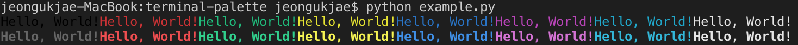

# terminal-palette

[](https://travis-ci.org/JeongUkJae/terminal-palette) [](https://codecov.io/gh/jeongukjae/terminal-palette) [](https://pypi.org/manage/project/terminal-palette/releases/) [](https://pypi.org/manage/project/terminal-palette/releases/)

A simple library to color texts in terminal. (using ANSI color codes)

## How to install

```bash
$ pip install terminal-palette
```

## Quick Start

Usage:

```python
from terminal_palette import Palette

p = Palette()
# p.{keyword}.{keyword} ... ('some text')
p.underline.red.bg_white('some text')
```

available keyword:

- `black`
- `blue`
- `cyan`
- `green`
- `magenta`
- `red`
- `white`
- `yellow`
- `bright_black`
- `bright_blue`
- `bright_cyan`
- `bright_green`
- `bright_magenta`
- `bright_red`
- `bright_white`
- `bright_yellow`
- `bg_black`
- `bg_blue`
- `bg_cyan`
- `bg_green`
- `bg_magenta`
- `bg_red`
- `bg_white`
- `bg_yellow`
- `bg_bright_black`
- `bg_bright_blue`
- `bg_bright_cyan`
- `bg_bright_green`
- `bg_bright_magenta`
- `bg_bright_red`
- `bg_bright_white`
- `bg_bright_yellow`
- `bold`
- `reversed`
- `underline`

### 8 Colors (Foreground)

```python
from terminal_palette import Palette

palette = Palette()

print(
    palette.black('Hello, World!') +
    palette.red('Hello, World!') +
    palette.green('Hello, World!') +
    palette.yellow('Hello, World!') +
    palette.blue('Hello, World!') +
    palette.magenta('Hello, World!') +
    palette.cyan('Hello, World!') +
    palette.white('Hello, World!'))
print(
    palette.bright_black('Hello, World!') +
    palette.bright_red('Hello, World!') +
    palette.bright_green('Hello, World!') +
    palette.bright_yellow('Hello, World!') +
    palette.bright_blue('Hello, World!') +
    palette.bright_magenta('Hello, World!') +
    palette.bright_cyan('Hello, World!') +
    palette.bright_white('Hello, World!'))
```

Result:



### 8 Colors (Background)

```python
from terminal_palette import Palette

palette = Palette()

print(
    palette.bg_black('Hello, World!') +
    palette.bg_red('Hello, World!') +
    palette.bg_green('Hello, World!') +
    palette.bg_yellow('Hello, World!') +
    palette.bg_blue('Hello, World!') +
    palette.bg_magenta('Hello, World!') +
    palette.bg_cyan('Hello, World!') +
    palette.bg_white('Hello, World!'))
print(
    palette.bg_bright_black('Hello, World!') +
    palette.bg_bright_red('Hello, World!') +
    palette.bg_bright_green('Hello, World!') +
    palette.bg_bright_yellow('Hello, World!') +
    palette.bg_bright_blue('Hello, World!') +
    palette.bg_bright_magenta('Hello, World!') +
    palette.bg_bright_cyan('Hello, World!') +
    palette.bg_bright_white('Hello, World!'))
```

### RGB

```python
from terminal_palette import Palette

palette = Palette()

print(palette.rgb(10, 147, 256)("Hello, World!")) # foreground
print(palette.bg_rgb(10, 147, 147)("Hello, World!")) # background
```

### Text Decoration

```python
from terminal_palette import Palette

palette = Palette()

print(palette.bold('Hello, World!'))
print(palette.underline('Hello, World!'))
print(palette.reversed('Hello, World!'))
```

### Nested Style

```python
from terminal_palette import Palette

palette1 = Palette()
palette2 = Palette()

print(palette1.red('RED!!' + palette2.blue('BLUE!!') + 'RED AGAIN!!'))
```
